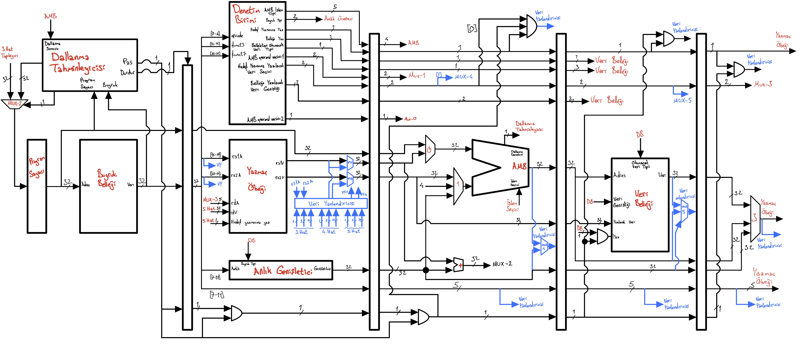

# RV32-IX İşlemci

Projede bilgisayar mimarisi ve FPGA üzerine araştırmalar yapılmıştır. Araştırmalar doğrultusunda bir RISC-V RV32-I buyruk kümesine sahip bir işlemciye karar kılınmıştır. İşlemcide **boru hattı**, **dallanma öngörüsü** ve **veri yönlendirme** yöntemlerinin kullanılmasına karar verilmiştir.

Ayrıca işlemcinin VHDL ile yazılıp FPGA gerçeklenmesine karar verilmiştir. Bunlar doğrultusnda 5 aşamalı bir boru hattına sahip işlemci dizayn edilmiştir. İşlemcide veri bağımlılıklarını çözmek için veri yönlendirmesi de yapılmıştır. RV32-I’daki 40 buyruktan 37’si bu tasarıma dahil edilmiştir. Bunun yanında **kriptografi işlemleri** için özel buyruklar da eklemiştir. İşlemci birimleri **VHDL** ile yazılmıştır.

İşlemcide şöyle bir sorun bulunmaktadır: Bellekten veri yükleme buyruğundan hemen sonra verinin yüklendiği yazmaç kullanılmaya çalışılınca bazı durumlarda hatalı sonuçlar verebiliyor. Bir de işlemcinin simülasyon ile az önceki hata dışında bir hata ile karşılaşılmamasına rağmen FPGA üzerindeki gerçeklemesinde hatalı sonuçlar vermektedir.

Geliştirilen işlemcinin daha iyi hale getirmek için birçok farklı şey yapılabilir. Bunları şu şekilde sıralayabiliriz:

- Yukarıda belirtilen 2 problem çözülebilir.
- Buyrukların iletilebilmesi için UART arayüzü konabilir.
- Ön Bellek eklenebilir.
- Daha iyi tahmin yapan bir dallanma öngörücüsü yapılabilir.
- Çoklu çekirdek şeklinde tasarlanabilir.
- RISC-V’in diğer buyruk uzantıları eklenebilir.

[Daha detaylı bilgi için raporu okuyabilirsiniz.](Rapor.pdf)

## İşlemcinin Şeması

